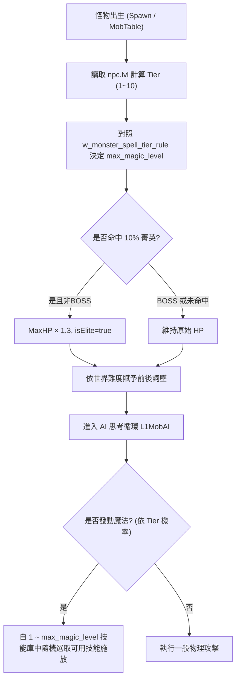

# 項目說明 — D系列怪物菁英化系統（Monster Elite System）

## 1. 基本資訊

| 欄位 | 值 |
|------|-----|
| **項目名稱** | D系列怪物菁英化系統 |
| **別名** | Monster Elite System / 菁英怪 / 怪物等級化施法體系 / 詞墜與抗性獨立系統 |
| **企劃來源** | `I:\天堂企劃.txt` 第 10~27 行 + 怪物依等級施放1~10級全職業魔法業務規格 |
| **清冊 ID** | SQL #154 `npc_202609221205.sql`、`mobskills_202609221205.sql`、`skills_202609221205.sql` |
| **module_id** | `D系列怪物菁英化系統` |

---

## 2. 完整業務流程與企劃規格

### 2.1 怪物等級與施法能力（怪物十級階梯施法）
小怪與 BOSS 依照 DB 中登錄之等級（`npc.lvl`，0~100 級），在系統中映射為 **1 ~ 10 級怪物階級 (Monster Tier)**：
- **怪物 Tier 映射公式**：
  $$\text{Tier} = \min\left(10, \max\left(1, \left\lfloor \frac{\text{npc.lvl} - 1}{10} \right\rfloor + 1 \right)\right)$$
  - **Tier 1 (Lv 1~10)**：最弱怪，僅能使用 **第 1 級基礎魔法**。
  - **Tier 2 (Lv 11~20)**：可使用 1~2 級魔法。
  - **Tier 3 (Lv 21~30)**：可使用 1~3 級魔法。
  - ...
  - **Tier 10 (Lv 91~100+)**：最強怪物／頂級世界 BOSS，解鎖 **1~10 級全套魔法庫**。

### 2.2 全職業技能等級化對照
遊戲內所有職業技能在 `skills` 表中依照階級與等級對應（普攻魔法、騎士技能、黑妖黑魔法、王族王權、精靈精靈魔法、龍騎秘術、幻術師立方、戰士泰坦技能）：
- 當怪物達到對應 Tier 時，系統允許其掛載並發動該階級（含）以下之全職業代表性技能（如：高級怪可施放衝擊之暈、黑闇之影、聖結界、乃至 10 級流星雨/究極光裂術）。

### 2.3 菁英化基礎與詞墜機制
1. **生成機率與血量規則**：
   - 一般小怪生成時有 **10%（1成）** 機率觸發為「菁英版本」。
   - **小怪血量 × 1.3**（基礎 HP × 1.3，即 +30%）。
   - **BOSS 血量不變**（BOSS 維持原始配置，不套用 1.3 倍血量乘算）。
2. **前後詞墜系統（Affix System）**：
   - 小怪與 BOSS 依世界難度額外獲得前綴或後綴詞墜（如：泰坦的、冰霜的、之雷擊、之毀滅）。
3. **抗性與魔法屬性體系拆分**：
   - 魔法屬性分開：地、水、火、風 四大屬性抗性獨立判定。
   - 物理抗性與魔法抗性分開獨立結算。
4. **召喚隊友 AI 傷害抗性**：
   - 玩家召喚獸/使徒/支援寵物受到菁英怪與 BOSS 攻擊時，套用專用傷害減免係數。
5. **掉落率加倍**：
   - 菁英怪死亡掉落判定 **× 2**。

---

## 3. DB Schema 設計

### 3.1 怪物施法階級規則表：`w_monster_spell_tier_rule` (InnoDB)
定義 1~10 級怪物階梯對應的施法等級上限、可用技能池與施法冷卻/機率：
```sql
CREATE TABLE IF NOT EXISTS `w_monster_spell_tier_rule` (
  `tier` tinyint(2) unsigned NOT NULL COMMENT '怪物階級 (1~10)',
  `min_lvl` int(3) unsigned NOT NULL COMMENT '對應最低怪物等級',
  `max_lvl` int(3) unsigned NOT NULL COMMENT '對應最高怪物等級',
  `max_magic_level` tinyint(2) unsigned NOT NULL COMMENT '允許施放之魔法等級上限 (1~10)',
  `allow_class_skills` tinyint(1) NOT NULL DEFAULT 1 COMMENT '是否開放全職業技能對應階級施放',
  `spell_chance_pct` int(3) unsigned NOT NULL DEFAULT 20 COMMENT 'AI施法觸發機率%',
  `tier_name` varchar(32) NOT NULL DEFAULT '' COMMENT '階級描述',
  PRIMARY KEY (`tier`)
) ENGINE=InnoDB DEFAULT CHARSET=utf8 COMMENT='怪物1~10級階梯施法規則表';

INSERT INTO `w_monster_spell_tier_rule`
  (`tier`, `min_lvl`, `max_lvl`, `max_magic_level`, `allow_class_skills`, `spell_chance_pct`, `tier_name`)
VALUES
  (1, 1, 10, 1, 0, 10, '一階弱小怪 (僅1級魔法)'),
  (2, 11, 20, 2, 0, 12, '二階普通怪 (1~2級魔法)'),
  (3, 21, 30, 3, 1, 15, '三階進階怪 (1~3級魔法)'),
  (4, 31, 40, 4, 1, 18, '四階精銳怪 (1~4級魔法)'),
  (5, 41, 50, 5, 1, 20, '五階統領怪 (1~5級魔法)'),
  (6, 51, 60, 6, 1, 22, '六階王國怪 (1~6級魔法)'),
  (7, 61, 70, 7, 1, 25, '七階深淵怪 (1~7級魔法)'),
  (8, 71, 80, 8, 1, 28, '八階傳奇怪 (1~8級魔法)'),
  (9, 81, 90, 9, 1, 30, '九階神話怪 (1~9級魔法)'),
  (10, 91, 127, 10, 1, 35, '十階滅世BOSS (全套1~10級魔法與全職技能)')
ON DUPLICATE KEY UPDATE `tier_name`=VALUES(`tier_name`);
```

### 3.2 難度配置表與詞墜表
- `w_elite_monster_config` (InnoDB)
- `w_monster_affix_template` (InnoDB)

---

## 4. 850 原生核心 Hook 與執行期架構



---

## 5. 狀態與決策

```text
DECISION=HOLD
SERVER_LEVEL=L3 (等級分階施法引擎 + 全職技能階梯映射 + 菁英血量/詞墜 + 傷害抗性拆分)
CLIENT_GATE=NOT_PROVEN
LAST_UPDATED=2026-09-25
```
