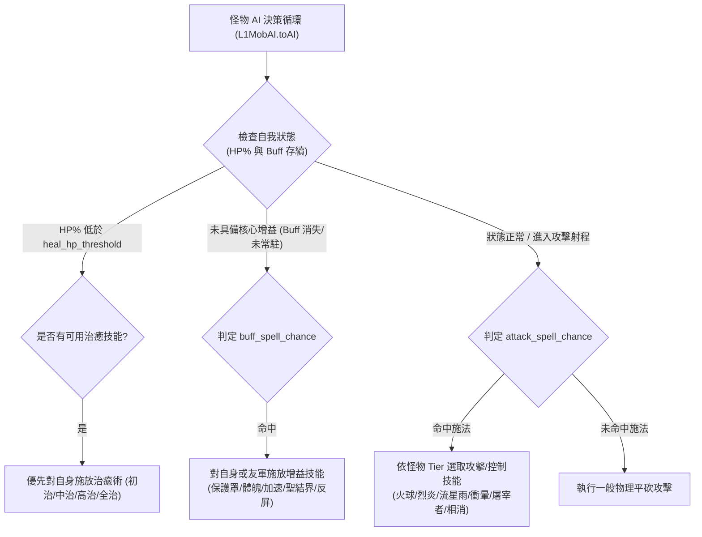

# 項目說明 — D系列怪物菁英化系統（Monster Elite System）

## 1. 基本資訊

| 欄位 | 值 |
|------|-----|
| **項目名稱** | D系列怪物菁英化系統 |
| **別名** | Monster Elite System / 菁英怪 / 怪物雙軌施法體系（攻擊/增益） / 詞墜與抗性獨立系統 |
| **企劃來源** | `I:\天堂企劃.txt` 第 10~27 行 + 怪物依等級分10級使用玩家技能（攻擊/增益雙軌）規格 |
| **清冊 ID** | SQL #154 `npc_202609221205.sql`、`mobskills_202609221205.sql`、`skills_202609221205.sql` |
| **module_id** | `D系列怪物菁英化系統` |

---

## 2. 完整業務流程與企劃規格

### 2.1 怪物等級分 10 級階梯（Monster Tier 1 ~ 10）
小怪與 BOSS 依照 DB 中登錄之等級（`npc.lvl`，0~100 級），在系統中映射為 **1 ~ 10 級怪物階級 (Monster Tier)**：
- **怪物 Tier 映射公式**：
  $$\text{Tier} = \min\left(10, \max\left(1, \left\lfloor \frac{\text{npc.lvl} - 1}{10} \right\rfloor + 1 \right)\right)$$
  - **Tier 1 (Lv 1~10)**：最弱怪，僅能使用 **第 1 級基礎魔法**。
  - **Tier 2 (Lv 11~20)**：可使用 1~2 級魔法。
  - ...
  - **Tier 10 (Lv 91~100+)**：最強怪物／頂級世界 BOSS，解鎖 **1~10 級全套魔法庫**。

### 2.2 怪物使用玩家技能進行「攻擊」與「增益」（雙軌施法 AI）
怪物不再只是單純平砍，而是全面引入玩家全職業技能，依據戰鬥態勢區分為 **攻擊型技能 (Attack Spell)** 與 **增益型技能 (Buff/Heal Spell)** 雙軌：

1. **增益型技能（Buff / Heal / Defense）**：
   - **戰鬥前／開戰時自套 Buff**：
     - 低階怪（Tier 1~3）：保護罩、神聖武器、擬似魔法武器、鎧甲護持。
     - 中階怪（Tier 4~6）：體魄強健術、加速術、通暢氣脈術、燃燒鬥志、影之防護。
     - 高階怪與 BOSS（Tier 7~10）：強力加速術、狂暴術、聖結界、反擊屏障、堅固防護、大地防護/屏障、絕對屏障。
   - **血量告急時主動補血 (Heal AI)**：
     - 當血量低於門檻（如 40%）：
       - 低階怪：初級治癒術、中級治癒術。
       - 高階怪/BOSS：高級治癒術、全部治癒術、治癒能量風暴。
2. **攻擊型與控場技能（Attack / CC / Debuff）**：
   - **遠程魔法攻擊**：
     - 低階怪：光箭、冰箭、風刃、火箭。
     - 中階怪：燃燒的火球、極道落雷、冰錐、地裂術、烈炎術、吸血鬼之吻。
     - 高階怪/BOSS：冰雪暴、雷霆風暴、火風暴、流星雨、究極光裂術。
   - **全職業代表性控制與爆發技能**：
     - 騎士系：衝擊之暈（暈眩玩家）。
     - 黑妖系：雙重破壞、暗影之牙、破壞盔甲。
     - 精靈系：三重矢、弱化屬性、封印禁地。
     - 龍騎系：屠宰者、奪命之雷。
     - 戰士系：泰坦狂暴、拘束移動。

### 2.3 菁英化基礎與詞墜機制
1. **生成機率與血量規則**：
   - 一般小怪生成時有 **10%（1成）** 機率觸發為「菁英版本」。
   - **小怪血量 × 1.3**（基礎 HP × 1.3，即 +30%）。
   - **BOSS 血量不變**（BOSS 維持原始配置，不套用 1.3 倍血量乘算）。
2. **前後詞墜系統（Affix System）**：
   - 小怪與 BOSS 依世界難度額外獲得前綴或後綴詞墜（如：泰坦的、冰霜的、之雷擊、之毀滅）。
3. **抗性與魔法屬性體系拆分**：
   - 魔法屬性分開：地、水、火、風 四大屬性抗性獨立判定。
   - 物理抗性與魔法抗性分開獨立結算。
4. **召喚隊友 AI 傷害抗性**：
   - 玩家召喚獸/使徒/支援寵物受到菁英怪與 BOSS 攻擊時，套用專用傷害減免係數。
5. **掉落率加倍**：
   - 菁英怪死亡掉落判定 **× 2**。

---

## 3. DB Schema 設計

### 3.1 怪物施法階級規則表：`w_monster_spell_tier_rule` (InnoDB)
定義 1~10 級怪物階梯對應的施法等級上限、攻擊/增益施法機率與技能池：
```sql
CREATE TABLE IF NOT EXISTS `w_monster_spell_tier_rule` (
  `tier` tinyint(2) unsigned NOT NULL COMMENT '怪物階級 (1~10)',
  `min_lvl` int(3) unsigned NOT NULL COMMENT '對應最低怪物等級',
  `max_lvl` int(3) unsigned NOT NULL COMMENT '對應最高怪物等級',
  `max_magic_level` tinyint(2) unsigned NOT NULL COMMENT '允許施放之魔法等級上限 (1~10)',
  `allow_class_skills` tinyint(1) NOT NULL DEFAULT 1 COMMENT '是否開放全職業技能對應階級施放',
  `attack_spell_chance_pct` int(3) unsigned NOT NULL DEFAULT 20 COMMENT '攻擊型施法觸發機率%',
  `buff_spell_chance_pct` int(3) unsigned NOT NULL DEFAULT 15 COMMENT '增益/自保型施法觸發機率%',
  `heal_hp_threshold_pct` int(3) unsigned NOT NULL DEFAULT 35 COMMENT '觸發補血治癒之HP百分比閥值',
  `tier_name` varchar(32) NOT NULL DEFAULT '' COMMENT '階級描述',
  PRIMARY KEY (`tier`)
) ENGINE=InnoDB DEFAULT CHARSET=utf8 COMMENT='怪物1~10級階梯施法規則表';

INSERT INTO `w_monster_spell_tier_rule`
  (`tier`, `min_lvl`, `max_lvl`, `max_magic_level`, `allow_class_skills`, `attack_spell_chance_pct`, `buff_spell_chance_pct`, `heal_hp_threshold_pct`, `tier_name`)
VALUES
  (1, 1, 10, 1, 0, 10, 10, 30, '一階弱小怪 (僅1級光箭/保護罩/初治)'),
  (2, 11, 20, 2, 0, 12, 12, 30, '二階普通怪 (1~2級火箭/擬似武器/毒咒)'),
  (3, 21, 30, 3, 1, 15, 12, 35, '三階進階怪 (1~3級極光雷電/中治/鎧甲護持)'),
  (4, 31, 40, 4, 1, 18, 15, 35, '四階精銳怪 (1~4級火球/吸血/通暢/緩速)'),
  (5, 41, 50, 5, 1, 20, 15, 40, '五階統領怪 (1~5級落雷/高治/木乃伊/黑闇之影)'),
  (6, 51, 60, 6, 1, 22, 18, 40, '六階王國怪 (1~6級烈炎/地裂/加速/體魄/相消)'),
  (7, 61, 70, 7, 1, 25, 20, 45, '七階深淵怪 (1~7級冰矛/狂暴/體力回復/神疾)'),
  (8, 71, 80, 8, 1, 28, 22, 45, '八階傳奇怪 (1~8級冰雪暴/全治/火牢/反屏/衝暈)'),
  (9, 81, 90, 9, 1, 30, 25, 50, '九階神話怪 (1~9級雷霆/聖結界/沉睡/火風暴/雙重破壞)'),
  (10, 91, 127, 10, 1, 35, 30, 50, '十階滅世BOSS (全套1~10級流星雨/究光/絕屏/全職大招)')
ON DUPLICATE KEY UPDATE `tier_name`=VALUES(`tier_name`);
```

### 3.2 難度配置表與詞墜表
- `w_elite_monster_config` (InnoDB)
- `w_monster_affix_template` (InnoDB)

---

## 4. 核心 AI 施法管線架構 (L1MobAI)



---

## 5. 控制開關 (Config)

| 參數 key | 預設值 | 說明 |
|---------|-------|------|
| `EliteMonsterEnabled` | `true` | 是否啟用怪物菁英化系統 |
| `MonsterSpellTierEnabled` | `true` | 是否啟用怪物1~10級階梯施法系統 |
| `MonsterUsePlayerBuffSkills` | `true` | 怪物是否主動施放增益與補血技能 (保護罩/加速/聖結界/高治等) |
| `MonsterUsePlayerAttackSkills` | `true` | 怪物是否使用玩家攻擊與控制技能 (火箭/烈炎/衝暈/流星雨等) |
| `EliteMonsterSpawnChance` | `10` | 小怪菁英化生成機率(%) |
| `EliteMonsterHpMultiplierPct` | `130` | 小怪菁英HP倍率(%) |
| `EliteDropRateMultiplierPct` | `200` | 菁英掉落率加倍(%) |
| `SummonAiDamageReductionPct` | `30` | 召喚隊友AI傷害減免保護(%) |

---

## 6. 狀態與決策

```text
DECISION=HOLD
SERVER_LEVEL=L3 (怪物AI雙軌施法決策樹 + 1~10階梯技能庫 + 菁英化/詞墜 + 傷害抗性獨立)
CLIENT_GATE=NOT_PROVEN (使用遊戲既有技能封包與動畫 GFX，無客製客戶端協議阻塞)
LAST_UPDATED=2026-09-25
```
