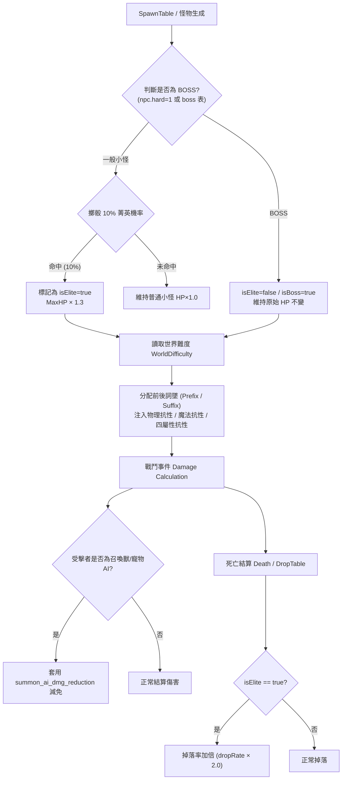

# 項目說明 — D系列怪物菁英化系統（Monster Elite System）

## 1. 基本資訊

| 欄位 | 值 |
|------|-----|
| **項目名稱** | D系列怪物菁英化系統 |
| **別名** | Monster Elite System / 菁英怪 / Elite Monster / 詞墜與抗性獨立系統 |
| **企劃來源** | `I:\天堂企劃.txt` 第 10~27 行（D系列怪物菁英化系統） |
| **清冊 ID** | SQL #154 `npc_202609221205.sql`、`w_屬性強化系統_202609221205.sql` |
| **module_id** | `D系列怪物菁英化系統` |

---

## 2. 完整業務流程與企劃規格

依據 `天堂企劃.txt` 條目，本系統涵蓋五大核心規則：

1. **生成機率與血量規則**：
   - 一般小怪生成時有 **10%（1成）** 機率觸發為「菁英版本」。
   - **小怪血量 × 1.3**（基礎 HP × 1.3，即 +30%）。
   - **BOSS 血量不變**（BOSS 不套用 1.3 倍血量乘算，維持原始配置）。
2. **前後詞墜系統（Affix System）**：
   - 小怪與 BOSS 皆適用詞墜規則。
   - 依照「世界難度等級（World Difficulty Level）」動態決定詞墜條數：
     - 普通難度：無或基礎 1 條詞墜。
     - 困難/地獄難度：遞增 1 條前綴詞墜或後綴詞墜（例如：強壯的、冰霜的、迅速的…）。
     - 前綴影響基礎攻防與血量/抗性，後綴影響附加技能、反彈或異常狀態。
3. **抗性與魔法屬性體系拆分**：
   - **魔法屬性系統分開**：地、水、火、風 四大屬性獨立計算抗性與剋制傷害。
   - **物理抗性與魔法抗性分開**：
     - 物理傷害減免（Physical Damage Reduction / 物理抗性）獨立生效。
     - 魔法傷害減免（Magic Damage Reduction / 魔法抗性 / MR 曲線）獨立計算。
     - 菁英怪與 BOSS 詞墜可分別針對物理抗性或魔法抗性進行增幅。
4. **召喚隊友 / AI 傷害抗性**：
   - 角色所召喚之隊友（召喚獸、寵物、使徒、支援 AI）具備獨立的 **傷害抗性計算路徑**。
   - 受到菁英怪與 BOSS 攻擊時，避免召喚物瞬間被秒殺，套用隊友 AI 抗性減免係數。
5. **掉落率加倍**：
   - 菁英版本怪物死亡時，掉落判定擲骰次數或機率 **加倍（× 2）**。

---

## 3. DB Schema 與規則表設計

### 3.1 菁英怪物難度配置表：`w_elite_monster_config` (InnoDB)
管理不同世界難度下的菁英生成機率、血量倍率、掉落加成與詞墜池：
```sql
CREATE TABLE IF NOT EXISTS `w_elite_monster_config` (
  `difficulty_level` tinyint(2) NOT NULL DEFAULT 0 COMMENT '世界難度等級: 0=普通 1=困難 2=惡夢 3=地獄',
  `difficulty_name` varchar(32) NOT NULL DEFAULT '' COMMENT '難度名稱',
  `mob_elite_chance_pct` int(3) unsigned NOT NULL DEFAULT 10 COMMENT '小怪生成菁英機率(%): 預設10%',
  `mob_hp_multiplier_pct` int(5) unsigned NOT NULL DEFAULT 130 COMMENT '小怪血量倍率(%): 130=x1.3',
  `boss_hp_multiplier_pct` int(5) unsigned NOT NULL DEFAULT 100 COMMENT 'BOSS血量倍率(%): 100=不變',
  `drop_rate_multiplier_pct` int(5) unsigned NOT NULL DEFAULT 200 COMMENT '掉落率倍率(%): 200=加倍',
  `affix_count` tinyint(2) unsigned NOT NULL DEFAULT 1 COMMENT '增加詞墜數量(依難度累加)',
  `prefix_pool` varchar(255) NOT NULL DEFAULT '' COMMENT '可選前綴ID清單(逗號分隔)',
  `suffix_pool` varchar(255) NOT NULL DEFAULT '' COMMENT '可選後綴ID清單(逗號分隔)',
  `summon_ai_dmg_reduction_pct` int(3) unsigned NOT NULL DEFAULT 30 COMMENT '對召喚隊友AI傷害減免%',
  PRIMARY KEY (`difficulty_level`)
) ENGINE=InnoDB DEFAULT CHARSET=utf8 COMMENT='D系列菁英怪世界難度配置';
```

### 3.2 詞墜規則定義表：`w_monster_affix_template` (InnoDB)
定義前綴與後綴詞墜對抗性（物理/魔法/四屬性）與技能的加成：
```sql
CREATE TABLE IF NOT EXISTS `w_monster_affix_template` (
  `affix_id` int(10) unsigned NOT NULL AUTO_INCREMENT COMMENT '詞墜ID',
  `affix_name` varchar(32) NOT NULL DEFAULT '' COMMENT '詞墜顯示名稱 (如: 堅硬、熔岩、狂暴)',
  `affix_type` enum('PREFIX','SUFFIX') NOT NULL DEFAULT 'PREFIX' COMMENT '前綴或後綴',
  `add_hp_pct` int(5) NOT NULL DEFAULT 0 COMMENT '額外HP%',
  `add_physical_reduction` int(5) NOT NULL DEFAULT 0 COMMENT '物理抗性/傷害減免',
  `add_magic_reduction` int(5) NOT NULL DEFAULT 0 COMMENT '魔法抗性減免',
  `add_fire_resist` int(3) NOT NULL DEFAULT 0 COMMENT '火屬性抗性',
  `add_water_resist` int(3) NOT NULL DEFAULT 0 COMMENT '水屬性抗性',
  `add_wind_resist` int(3) NOT NULL DEFAULT 0 COMMENT '風屬性抗性',
  `add_earth_resist` int(3) NOT NULL DEFAULT 0 COMMENT '地屬性抗性',
  `proc_skill_id` int(10) unsigned NOT NULL DEFAULT 0 COMMENT '附加發動技能ID (0=無)',
  `proc_chance_pct` int(3) unsigned NOT NULL DEFAULT 0 COMMENT '發動機率%',
  `aura_gfx_id` int(10) unsigned NOT NULL DEFAULT 0 COMMENT '怪物外觀光圈/特效GFX (0=無)',
  PRIMARY KEY (`affix_id`)
) ENGINE=InnoDB DEFAULT CHARSET=utf8 COMMENT='菁英怪與BOSS前後詞墜庫';
```

---

## 4. 850 原生核心 Hook 與執行期架構



### 核心修改點對照 (850-first)：
1. **`L1MonsterInstance`**：
   - 增加 `boolean _isElite`、`List<MonsterAffix> _affixes`。
   - 獨立抗性欄位：`_physicalReduction`、`_magicReduction`、`_attrResistances[4]`。
2. **`L1Attack` / `L1Magic` 傷害管線**：
   - 物理傷害與魔法傷害獨立減免管線：
     - `physicalDamage = Math.max(0, rawDamage - target.getPhysicalReduction());`
     - `magicDamage = calcMagicDamage(...) * (1.0 - target.getMagicReductionPct());`
   - 對召喚隊友傷害保護：當 target 為 `L1SummonInstance` 或 `L1PetInstance` 時套用傷害抗性保護。
3. **`DropTable`**：
   - 判斷 `monster.isElite()`，若為 true 則掉落權重或 roll 次數加倍。

---

## 5. 控制開關 (Config)

| 參數 key | 預設值 | 說明 |
|---------|-------|------|
| `EliteMonsterEnabled` | `true` | 是否啟用怪物菁英化系統 |
| `EliteMonsterSpawnChance` | `10` | 小怪菁英化生成機率(%) |
| `EliteMonsterHpMultiplierPct` | `130` | 小怪菁英HP倍率(%) |
| `EliteDropRateMultiplierPct` | `200` | 菁英掉落率加倍(%) |
| `SummonAiDamageReductionPct` | `30` | 召喚隊友AI傷害減免保護(%) |
| `WorldDifficultyDefault` | `0` | 預設世界難度 (0=普通 1=困難 2=惡夢 3=地獄) |

---

## 6. 狀態與決策

```text
DECISION=HOLD
SERVER_LEVEL=L3 (怪物生成生命週期 + 戰鬥抗性拆分 + 隊友AI減免 + 詞墜工廠 + 掉落倍率)
CLIENT_GATE=NOT_PROVEN (主要為服務端運算；光圈 GFX 若無可退回普通模型，不阻塞核心邏輯)
PREREQUISITES=None (世界難度由本表原生提供配置)
LAST_UPDATED=2026-09-25
```
